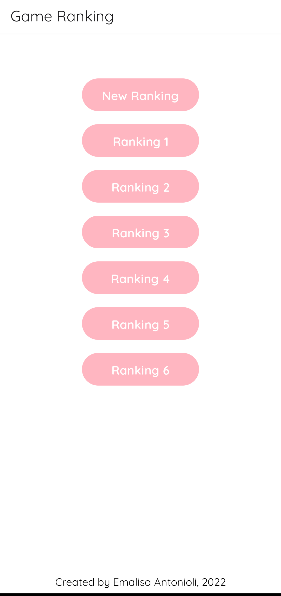
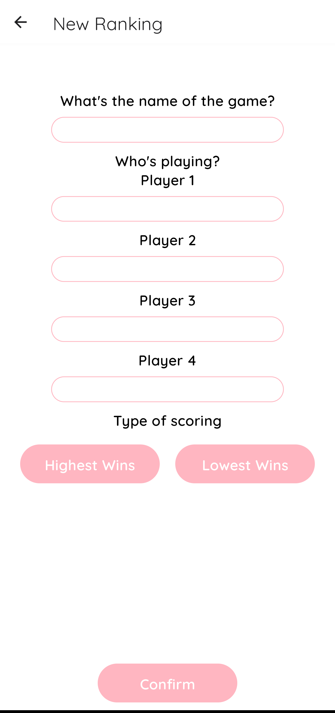
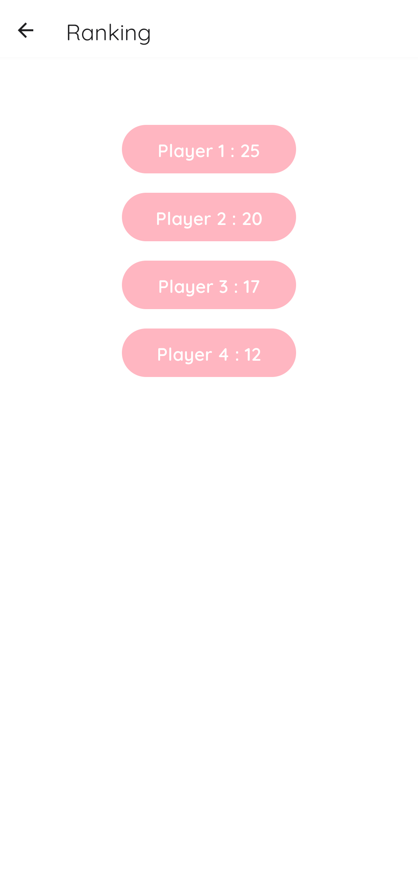
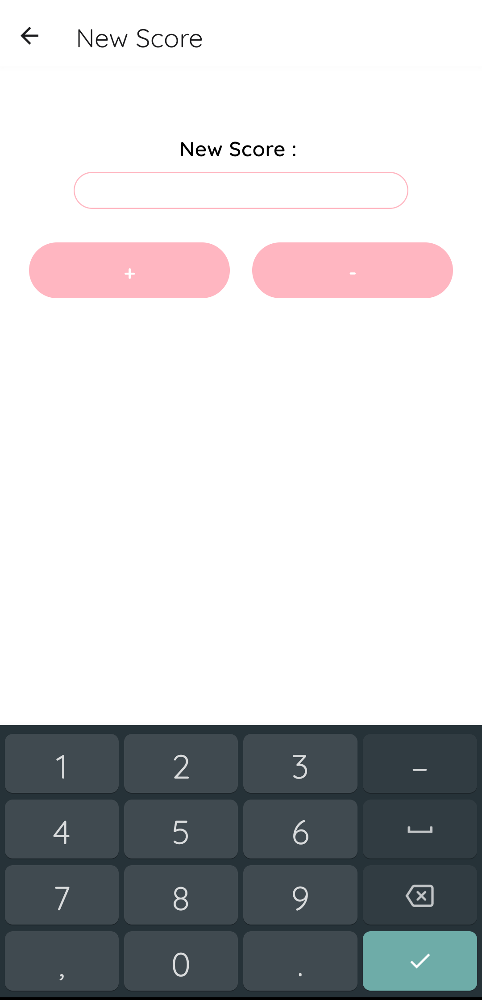

# Game Ranking
*Gemaakt door: Emalisa Antonioli*  
Deze opdracht is gemaatk als POP-project voor het vak Professional Skills 1 van de IT-factory van de Thomas More hogeschool. Dit file zal eerst een overzicht geven van hoe de applicatie werkt en er uitziet, vervolgens zal een krot overzicht gegeven worden van het ontwikkelingsproces van de applicatie en uiteindelijk zal een zelf-evaluatie gegeven worden over mijn prestaties tijdens dit project.

## Overzicht applicatie
Deze applicatie is ontwerpen om gemakkelijk scores bij te kunnen houden tijdens het spelen van kaartspelletjes, het overzicht van de scores van een spelletje wordt in de app een ‘game ranking genoemd’.  
 
De app opent met een menu dat een overzicht geeft van alle eerder aangemaakte game rankings, met bovenaan een knop ‘New Ranking’ dat de mogelijkheid geeft om een nieuwe game ranking aan te maken. 
 
Wanneer op deze knop wordt gedrukt opent de New Ranking pagina, waar de naam van het spel en de namen van vier spelers opgegeven kunnen worden en waar voor ‘Highest Wins’ of ‘Lowest Wins’ gekozen kan worden; dit laatste bepaalt of de speler met de hoogste of juist met de laagste score wint. Wanneer op de knop ‘Confirm’ geklikt wordt zou er een nieuwe game ranking aangemaakt moeten worden. Deze functionaliteit ontbreekt echter nog omdat de database bij deze applicatie ontbreekt, meer hierover later meer in het database onderdeel van de ontwikkeling. Nu wordt vanuit de ‘Confirm’ knopt doorgeleid naar het hoofdmenu. Op dit scherm zijn ook knoppen met de namen van alle actieve game rankings te zien, wanneer er op deze knop gedrukt wordt verschijnt het scherm met het overzicht van de ranking.  
 
Op dit scherm zijn de naam van het spel en de name van de vier spelers te zien met hun scores. Wanneer op de naam van een speler wordt gedrukt, wordt er doorverwezen naar het ‘New Score’ scherm.  
 
Op dit scherm kan de waarde van de nieuwe score ingevuld worden en kan worden aangegeven of dit van de huidige score moet worden afgetrokken of erbij opgeteld. De functionaliteit van het updaten van de score, en het vervolgens in de juiste volgorde zetten van de spelers op de Ranking pagina is nog niet werkend vanwege de eerdergenoemde ontbrekende database. 

## Downloaden
Het downloaden van deze applicatie wordt niet aangeraden aangezien hij nog niet af is. Om deze app te downloaden op een smartphone moet eerste deze repository gecloned worden naar een laptop. Op de latop moet [adb geïnstalleerd worden](https://www.xda-developers.com/install-adb-windows-macos-linux/). Vervolgens moet op de smartphone [‘developer’ mode ingeschakeld worden](https://www.xda-developers.com/install-adb-windows-macos-linux/). De smartphone moet met een usb-kabel met de laptop verbonden worden, waarna met *adb install com.emalisa.gameranking* de app op de smartphone geïnstalleerd kan worden. 

## Ontwikkeling
Voor deze applicatie is gebruik gemaakt van het platform [React Native](https://reactnative.dev/). Dit is een platform ontwikkeld door Meta Platforms, Inc. dat gebaseerd is op JavaScript en als voornaamste troef heeft dat de applicaties werken op zowel Android als iOS. Voor aanvang van dit project had ik met zowel React Native en JavaScript geen ervaring. Ik ben daarom begonnen met het leren van de beginselen van de taal en het platform. Zodra ik me vertrouwd voelde met de syntax van JavaScript en me bewust was van wat soort componenten React Native te bieden heeft, was het tijd om te beginnen aan de app. Om de applicatie tijdens de ontwikkelingsfase te kunnen simuleren, zonder de app steeds volledig te moeten downloaden, is gebruik gemaakt van [Expo](https://expo.dev/).

### Lay-out
Het ontwikkelen van de app begon met de vlakke lay-out. React Native heeft hier verschillende kant-en-klare componenten voor die met behulp van flexboxen op de pagina geordend kunnen worden, vergelijkbaar met HTML. Er is ook de mogelijkheid om een style sheet te gebruiken, vergelijkbaar met CSS, en om zelf componenten te maken. Met dit laatste is geëxperimenteerd maar uiteindelijk is gekozen om te werken met de door React Native aangeleverde componenten, aangepast met behulp van een style sheet.

### Navigatie
Om tussen de verschillende pagina’s te kunnen navigeren wordt in React Native gebruik gemaakt van een [NavigationContainer](https://reactnavigation.org/). Vervolgens kunnen verschillende soorten navigatie toegepast worden. Voor deze applicatie is geëxperimenteerd met tab-navigatie en stack-navigatie en uiteindelijk werd besloten dat die laatste voor de beste gebruikservaring zorgde. Met deze vorm van navigatie kan altijd makkelijk terug gegaan worden naar de vorige pagina.

### Database
Het koppelen van een database was het lastigste onderdeel van deze applicatie en is ook niet gelukt. Het plan was initieel om een sqlite database toe te voegen. Na het volgen van veel tutorials werd het duidelijk dat dit niet werkte; met hulp van mevrouw M. Eyskens kwam ik erachter dat dit kwam doordat ik met Expo werkte en de tutorials niet, wat betekent dat mijn applicatie op een andere manier gebuild werd waardoor ik op een andere manier met mijn database moest omgaan. Hier was minder informatie over te vinden, wat mij deed besluiten om het idee van een sqlite database los te laten. Na het inlezen over veel verschillende databases, zoals Firebase en IndexedDB, heb ik uiteindelijk besloten om, op advies van meneer B. Pulmans, een MySQL database te hosten op mijn laptop en die te gebruiken voor mijn applicatie. Het hosten van een MySQL database is gelukt, de code daarvoor kan gevonden worden in routes.js, maar het ophalen van informatie uit deze database vanuit de applicatie is helaas niet gelukt. Aangezien hier op dit punt al vele uren werk in zat heb ik het besluit moeten maken om het hierbij te laten en is de applicatie dus niet functioneel.

## Zelf-evaluatie
Terugkijkend naar het project ben ik tevreden met alles dat ik heb bereikt en voornamelijk alles dat ik heb geleerd ben ik erg tevreden. Ik heb een volledig nieuw platform leren kennen en zelfs een nieuwe taal (alhoewel de taal ook werd behandeld in het vak Webdesign Advanced, wat ik tegelijkertijd volgde). Ook merkte ik tijdens dit project dat het leren van deze nieuwe dingen een stuk vlotter ging dan in het verleden, wat voor mij een duidelijke indicatie was voor mijn groei als programmeur. Ik vind het wel jammer dat het mij niet is gelukt om een database te koppelen aan mijn applicatie en ik ben daarom zeker van plan om op een later moment hier verder aan te werken. Toch zorgt dit er niet voor dat ik ontevreden terugkijk op het project aangezien ik weet dat ik hier mijn best voor heb gedaan en dat ik ruim over de tijd zat die voor dit project bedoeld was. Al met al vond ik dit een fijn project om aan te werken en ben ik voldaan met de uitkomst.